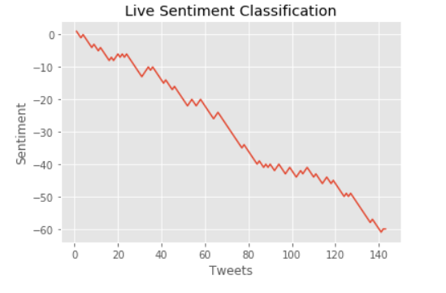

# Sentiment Analysis for Live Tweets

In this project, I intend to fetch the tweets using twitter api and classify those tweets
either as positive or negative in relevance to the issue. Classification is done using 
several machine learning algorithms such as <b>Naive Bayes</b>, <b>Multinomial Naive Bayes</b>,
<b>Bernoulli Naive Bayes</b>, <b>Logistic Regression</b>, <b>Linear Support Vector Machine</b>,
<b>Stochastic Gradient Descent</b>.

All the aforementioned algorithms are used to classify a 
tweet using a set of features and finally a vote classifier is deployed which takes the vote 
from each classifier and finally return the <u>classification</u> along with the <u>confidence</u> (probability)
for a particular tweet.

Live graph is plotted using matplotlib for those tweets for which the vote classifier has
confidence is greater than or equal to 80%. Graph is updated after every 1 sec and plots the 
sentiment classification for last 200 tweets.

&nbsp; &nbsp; &nbsp; &nbsp; &nbsp; &nbsp; &nbsp; &nbsp; &nbsp;
&nbsp; &nbsp; &nbsp; &nbsp; &nbsp; &nbsp; &nbsp; &nbsp; &nbsp;
&nbsp; &nbsp; &nbsp; &nbsp; &nbsp; &nbsp; &nbsp; &nbsp; &nbsp;
&nbsp; &nbsp; &nbsp; &nbsp; &nbsp; &nbsp; &nbsp; &nbsp; &nbsp;

## Graphing Live Tweet Sentiment Analysis

&nbsp; &nbsp; &nbsp; &nbsp; &nbsp; &nbsp; &nbsp; &nbsp; &nbsp;
&nbsp; &nbsp; &nbsp; &nbsp; &nbsp; &nbsp; &nbsp; &nbsp; &nbsp;
&nbsp; &nbsp; &nbsp; &nbsp; &nbsp; &nbsp; &nbsp; &nbsp; &nbsp;
&nbsp; &nbsp; &nbsp; &nbsp; &nbsp; &nbsp; &nbsp; &nbsp; &nbsp;
&nbsp; &nbsp; &nbsp; &nbsp; &nbsp; &nbsp; &nbsp; &nbsp; &nbsp;
&nbsp; &nbsp; &nbsp; &nbsp; &nbsp; &nbsp; &nbsp; &nbsp; &nbsp;
